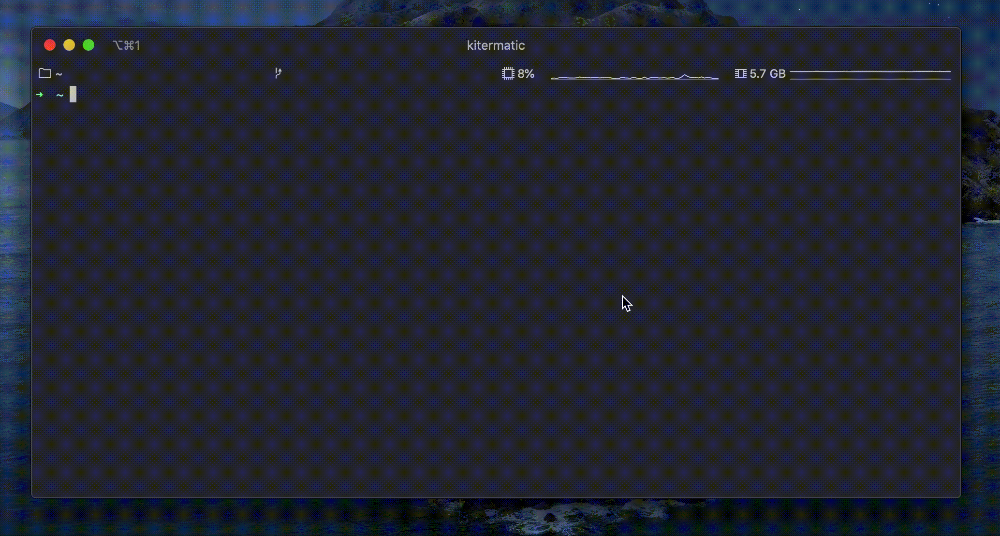

# kitermatic

[](https://github.com/gjuchault/kitermatic/blob/master/LICENSE)
[](https://travis-ci.org/gjuchault/kitermatic.svg?branch=master)
[](https://david-dm.org/gjuchault/kitermatic)


Kitematic for the terminal :whale: :wrench:

               ###########
           ###################
         #######################
       ###########################
      ####     ###      #      ####
     #####     #      #####    #####
    ######           #######   #####
    ######           #######   ######
    ######      #     #####    ######
     #####     ###    ####     #####
     #####     ###     ###     #####
      ####     ####     #      ####
       ###########################
         #######################
           ###################
               ############



## Installation

```
npm install -g kitermatic
```

## env variables / config

| Environment variable  |             Description             | Default |
|-----------------------|-------------------------------------|---------|
| KTRM_UI_THEME_BG      | theme color                         | cyan    |
| KTRM_UI_THEME_FG      | foreground on theme                 | black   |
| KTRM_REFRESH_INTERVAL | milliseconds before refreshing list | 3000    |
| KTRM_LOGS_TAIL        | logs line to fetch                  | 1000    |

## Build

```
yarn build
```

## Development

```
yarn dev
```
